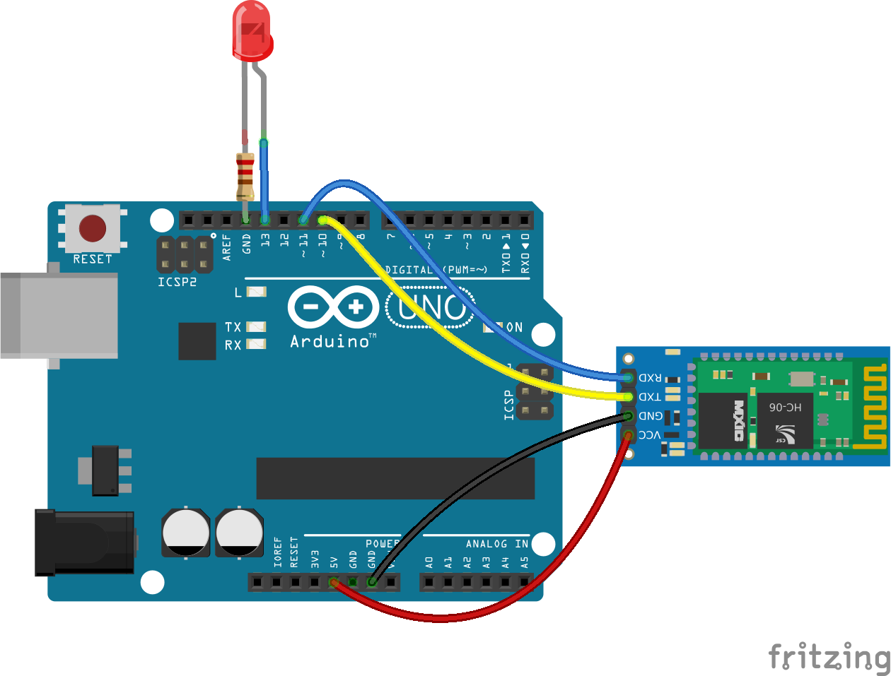
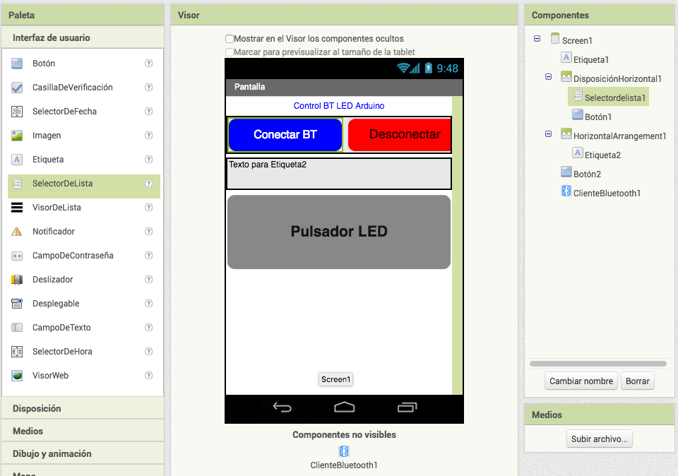
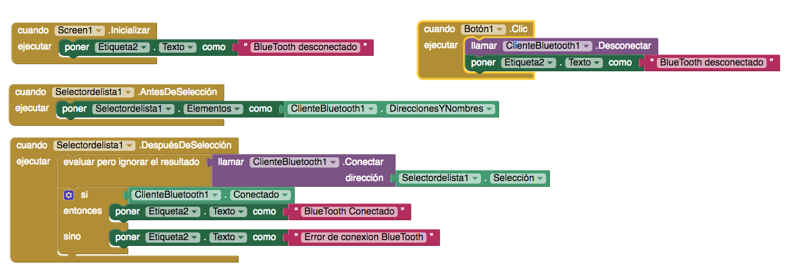
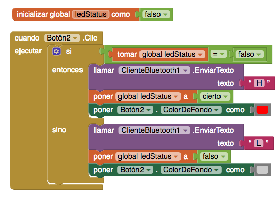

# LED-BT

Control del encendido de un LED mediante un boton en App Inventor
Se usa la librería software serial de Arduino para comunicar mediante Bluettoth por los pines 10 y 11

# Hardware

# Software en App Inventor

