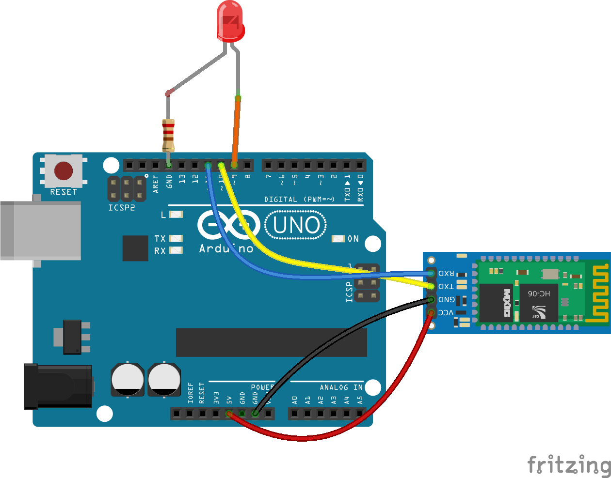
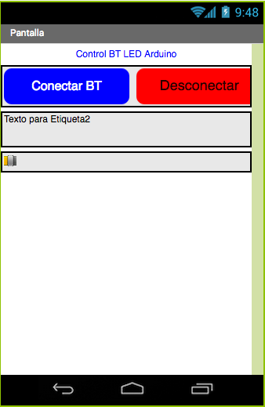
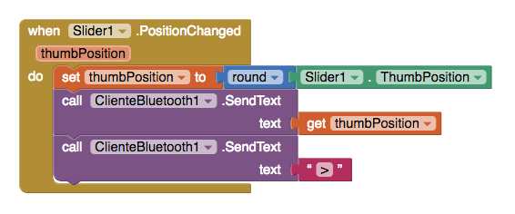

# LED-BT-PWM

Control del brillo de un LED mediante un deslizador (slider) en App Inventor
Se usa la librería software serial para comunicar mediante Bluettoth por los pines 10 y 11

# Hardware

# Software en App Inventor

