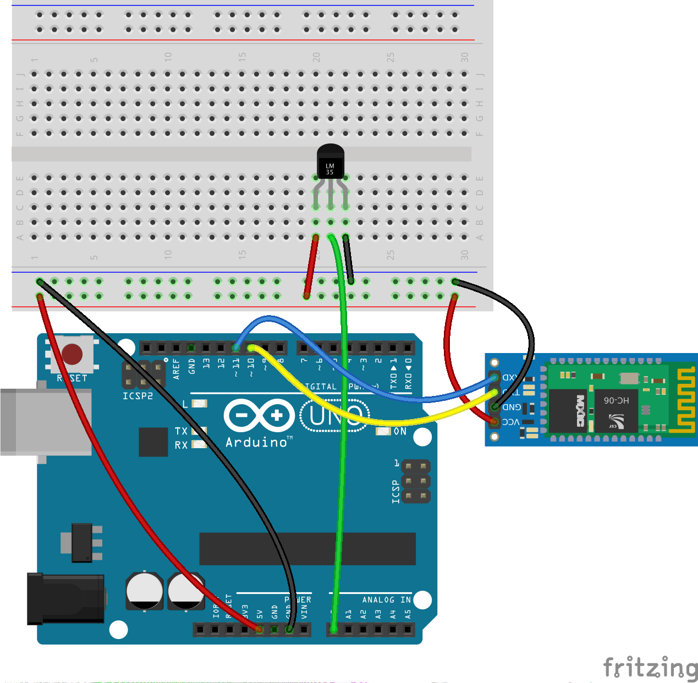

# Temperatura-BT

Medición de la temperatura con Arduino mediante un LM35. La temperatura se envía a App Inventor cuando se solicita mediante un botón.
Por lo que hay comunicación bidireccional

# Hardware

# Software en App Inventor

