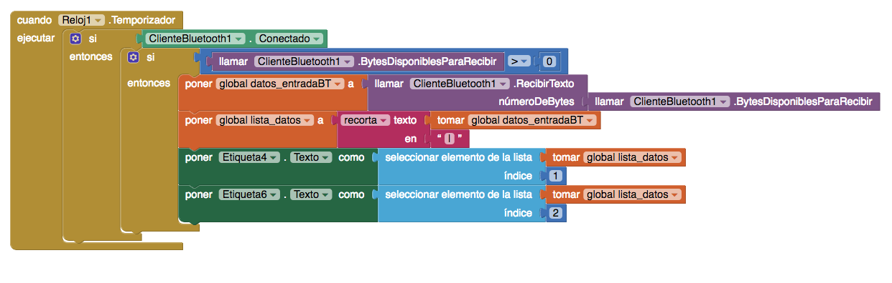

# Varios-Sensores-BT

Envio de varios sensores desde Arduino a App Inventor. Se usa un separador | para distinguir los diferentes datos. La recepción y envio de datos se hace mediante temporizador.

# Hardware

# Software en App Inventor

